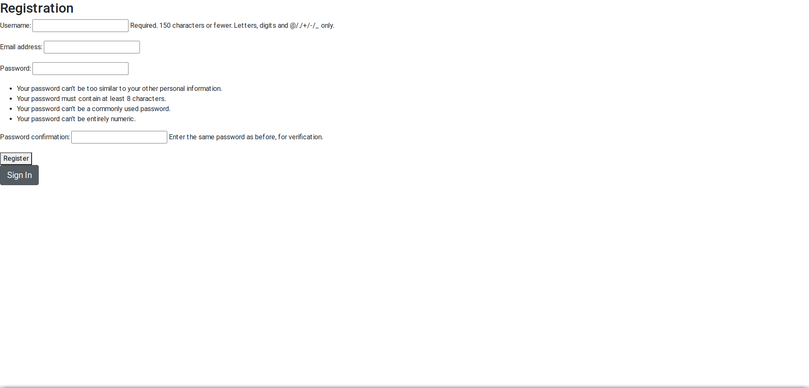
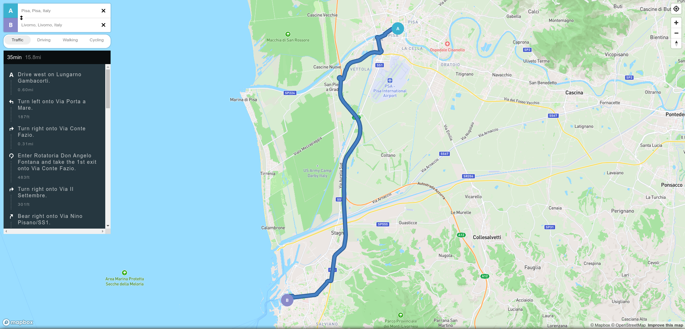

# Pinpoint


> The **Pinpoint** project is a Python/Django love-child meant to assist in the logistics context.
> Ever wonder how an average delivery goes about? Well mostly well, you'd say. **Pinpoint** is here to minimize time and uncertainty of a new address. 

> The project currently relies heavily on **Mapbox** APIs, in the future I'd like to implement more open-source solutions such as **Leaflet** JS-library for providing map tiles and **Project OSRM**, a routing service. 

> The scope of this project is to help businesses to locate, assess and store any helpful information on a potential delivery. <br>
> . . . Updating . . .

## Current state:
>Alpha-demo stage: <br>
>-awful sign-up form;<br>
>-brief sign-in; <br>
>-basic models should be ok but are barely usable at the moment;<br>
>-basic map routing visualization using Mapbox API

## Demo pics (work in progress):
><h4>Registration form :

><h4>Login:

><h4>Navigation:



# Steps to run the repo

## 1. Clone the repo

```sh
$ git clone https://github.com/MindJoker/pinpoint.git

$ cd pinpoint
```

## 2. Open any text editor, in this case I'm using VSC
```sh
$ code .
```

## 3. Create and/or activate Python virtualenv

```sh
$ python3 -m venv .venv
```
### 3.a on macOS / Linux

```sh
$ source .venv/bin/activate
```

### 3.b on Windows Powershell

```powershell
.venv\Scripts\Activate.ps1
```

### 3.c on Windows Git Bash

```sh
$ source .venv/Scripts/activate
```
## 4. Install the required Python packages & create new project using Django

```sh
$ pip install Django

$ django-admin startproject 'yoursite' 
```

### 4.a runserver (remember to cd to the proper dir containing your project)

```sh
$ python manage.py runserver
```
##### (to stop the server press CTRL + C / CMD + C)


### 4.b create your app

```sh
$ python manage.py startapp 'myapp'
```

### 4.c EDIT myapp/models.py with the models you require

### 4.d make app usable

```sh
$ python manage.py makemigrations 'myapp'

$ python manage.py migrate
```

### 4.e create superuser

```sh
$ python manage.py createsuperuser
```

### 4.f edit myapp/admin.py file

### 4.g open the admin web interface at http://127.0.0.1:8000/admin

# Every time the data model is changed:

## 1 this implies that myapp/models.py has changed

## 2 launch migrations commands

```sh
$ python manage.py makemigrations

$ python manage.py migrate
```
## 3 edit myapp/admin.py file


### useful commands:
>*updated from time to time<br>*

while in (.venv):
```sh
$ pip freeze
    #or
$ pip freeze > requirements.txt 
```
Outputs installed packages in requirements format.

(this only works if you are in .venv)

packages are listed in a case-insensitive sorted order, e.g. :

*you don't need all of them, that's just my current pip freeze so beware of the future, the ones you need in the current version should be highligted below*


>***asgiref==3.7.2<br>***
>asttokens==2.4.1<br>
>confusable-homoglyphs==3.3.1<br>
>decorator==5.1.1<br>
>***Django==5.0.3<br>
>django-extensions==3.2.3<br>
>django-registration==3.4<br>
>djangorestframework==3.15.1<br>***
>exceptiongroup==1.2.0<br>
>executing==2.0.1<br>
>ipython==8.22.2<br>
>jedi==0.19.1<br>
>matplotlib-inline==0.1.6<br>
>parso==0.8.3<br>
>pexpect==4.9.0<br>
>prompt-toolkit==3.0.43<br>
>ptyprocess==0.7.0<br>
>pure-eval==0.2.2<br>
>Pygments==2.17.2<br>
>six==1.16.0<br>
>***sqlparse==0.4.4<br>***
>stack-data==0.6.3<br>
>traitlets==5.14.2<br>
>***typing_extensions==4.10.0<br>***
>wcwidth==0.2.13<br>


>**Various sources:**

>https://www.mapbox.com/ remember to sign-up for your API Key <br>

>https://docs.djangoproject.com/en/5.0/ general Django 5 docs


